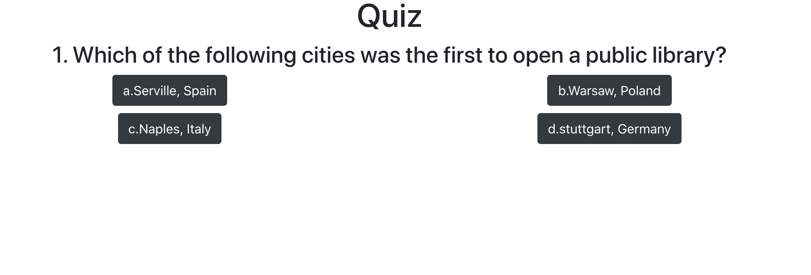

# Quiz App:

## Description

This quiz application engages users, in a fun-fact world trivia questions with multiple choice answers. It is engaging for game nights and a fun activity for families and friends to learn random facts around the world.  After the 5 questions, the user will be presented with a score page. And the option to retake the quiz again.

## How to Run

To run the application in development:

`npm start`

## Technologies

* React
* React Router
* Bootstrap

## Images

## Architecture (components)

1. Home  - /home - Show welcome greeting and a start quiz button
2. Quiz  - /quiz - Shows a question, multiple choice buttons with answers
3. Score - /score - Shows the user's score and a retake quiz button

